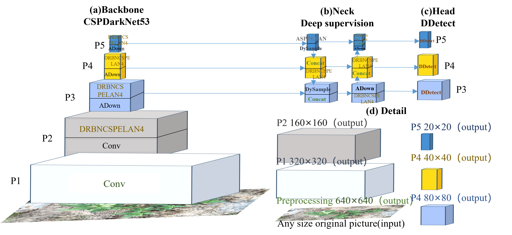

# DR-GELAN

Implementation of paper - [Weed Detection Model Based on Improved GELAN and Construction of Multi-Scene Weed Dataset]()

<div align="center">
    <a href="./">
        
    </a>
</div>


## Performance 

Sixweeds

| Model        | Test Size | AP<sup>val</sup> | AP<sub>50</sub><sup>val</sup> | Model Size（MB） | Param.  | FLOPs  |
| :----------- | :-------: | :--------------: | :--------------------------: | :--------------------------: | :-----: | :----: |
| **LW-YOLOv8m** | 640       | **0.849**        | **0.964**                    | **20.2**                    | **9.9M**| **38.0G** |
| **YOLOv9c**  | 640       | **0.878**        | **0.971**                    | **48.9**                    | **25.4M** | **103.2G** |
| **GELANc**   | 640       | **0.872**        | **0.963**                    | **51.4**                    | **25.4M** | **103.2G** |
| **YOLOv10l** | 640       | **0.829**        | **0.944**                    | **52.2**                    | **25.7M** | **127.2G** |
| **DR-GELANc**| 640       | **0.876**        | **0.972**                    | **45.7**                    | **22.6M** | **61.6G** |


<!-- small and medium models will be released after the paper be accepted and published. -->


## Installation

Docker environment (recommended)
<details><summary> <b>Expand</b> </summary>

``` shell
# create the docker container, you can change the share memory size if you have more.
nvidia-docker run --name dr-gelan -it -v your_coco_path/:/coco/ -v your_code_path/:/dr-gelan --shm-size=64g nvcr.io/nvidia/pytorch:21.11-py3

# apt install required packages
apt update
apt install -y zip htop screen libgl1-mesa-glx

# pip install required packages
pip install seaborn thop

# go to code folder
cd /dr-gelan
```

</details>


## Evaluation


``` shell
# evaluate dr-gelan models
# python val.py --data data/mycoco128.yaml --img 640 --batch 32 --conf 0.001 --iou 0.7 --device 0 --weights './gelan-c.pt' --save-json --name gelan_c_640_val
```


## Training

Data preparation

``` shell
bash scripts/get_coco.sh
```

*Download [Sixweeds dataset](https://github.com/guoao784/Sixweeds) images and labels.

Single GPU training

``` shell
# train dr-dr-gelan models
# python train.py --workers 8 --device 0 --batch 32 --data data/mycoco128.yaml --img 640 --cfg models/detect/dr-gelan-c.yaml --weights '' --name dr-gelan-c --hyp hyp.scratch-high.yaml --min-items 0 --epochs 500 --close-mosaic 15
```

Multiple GPU training

``` shell
# train dr-gelan models
# python -m torch.distributed.launch --nproc_per_node 4 --master_port 9527 train.py --workers 8 --device 0,1,2,3 --sync-bn --batch 128 --data data/mycoco128.yaml --img 640 --cfg models/detect/dr-gelan-c.yaml --weights '' --name gelan-c --hyp hyp.scratch-high.yaml --min-items 0 --epochs 500 --close-mosaic 15
```


## Re-parameterization

Under construction.


## Citation

```
1:@article{
  title={Weed Detection Model Based on Improved GELAN and Construction of Multi-Scene Weed Dataset},
  author={Ao Guo, Sensen Song, Zhenhong Jia, Jianyi Wang, Jiajia Wang and Gang Zhou},
  journal={2025 IEEE International Conference on Acoustics, Speech, and Signal Processing},
  year={2024}
}
```
```
Paper is currently under review. ;)
```
```
/2:@article{2024
  title={A lightweight weed detection model with global contextual joint features},
  author={Ao Guo, Zhenhong Jia, Jianyi Wang, Jiajia Wang , Gang Zhou, Baoquan Ge and Wei Chen},
  journal={Engineering Applications of Artificial Intelligence},
  year={2024}
}
```
```
https://doi.org/10.1016/j.engappai.2024.108903
```

```
@article{wang2024yolov9,
  title={{YOLOv9}: Learning What You Want to Learn Using Programmable Gradient Information},
  author={Wang, Chien-Yao  and Liao, Hong-Yuan Mark},
  booktitle={arXiv preprint},
  year={2024}
}
```

```
@article{chang2023yolor,
  title={{YOLOR}-Based Multi-Task Learning},
  author={Chang, Hung-Shuo and Wang, Chien-Yao and Wang, Richard Robert and Chou, Gene and Liao, Hong-Yuan Mark},
  journal={arXiv preprint arXiv:2309.16921},
  year={2023}
}
```


## Teaser

Parts of code of [A lightweight weed detection model with global contextual joint features](https://doi.org/10.1016/j.engappai.2024.108903) and [Learning What You Want to Learn Using Programmable Gradient Information](https://arxiv.org/abs/2402.13616) are released in the repository.


## Acknowledgements

<details><summary> <b>Expand</b> </summary>
    
* [https://github.com/guoao784/DR-GELAN](https://github.com/guoao784/DR-GELAN)
* [https://github.com/guoao784/Sixweeds](https://github.com/guoao784/Sixweeds)
* [https://github.com/guoao784/LW-YOLOv8](https://github.com/guoao784/LW-YOLOv8)
* [https://github.com/AlexeyAB/darknet](https://github.com/AlexeyAB/darknet)
* [https://github.com/WongKinYiu/yolor](https://github.com/WongKinYiu/yolor)
* [https://github.com/WongKinYiu/yolov7](https://github.com/WongKinYiu/yolov7)
* [https://github.com/VDIGPKU/DynamicDet](https://github.com/VDIGPKU/DynamicDet)
* [https://github.com/DingXiaoH/RepVGG](https://github.com/DingXiaoH/RepVGG)
* [https://github.com/ultralytics/yolov5](https://github.com/ultralytics/yolov5)
* [https://github.com/meituan/YOLOv6](https://github.com/meituan/YOLOv6)

</details>
